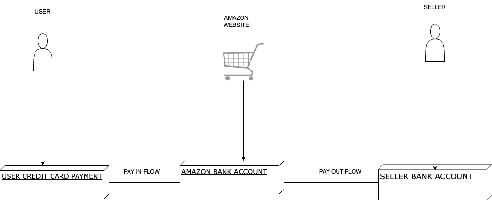
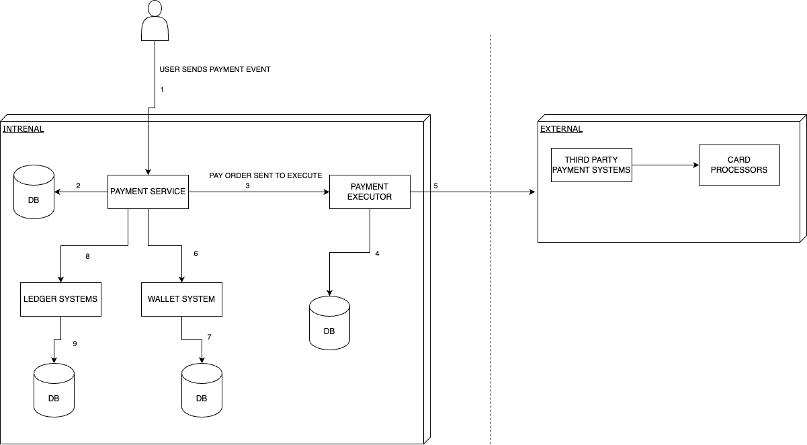
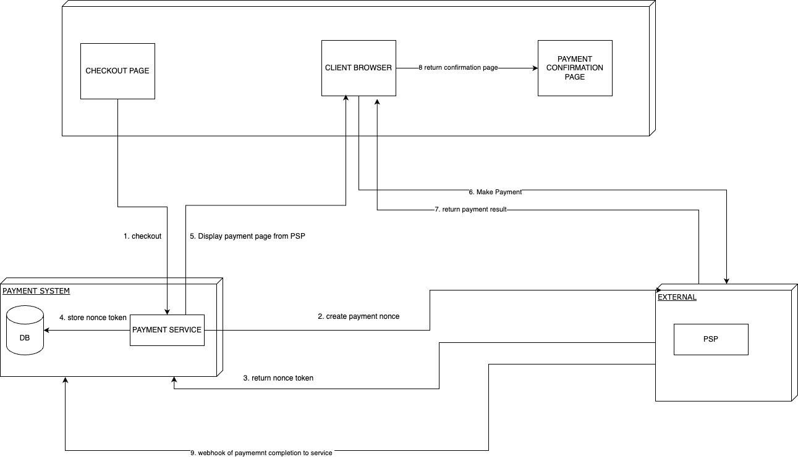
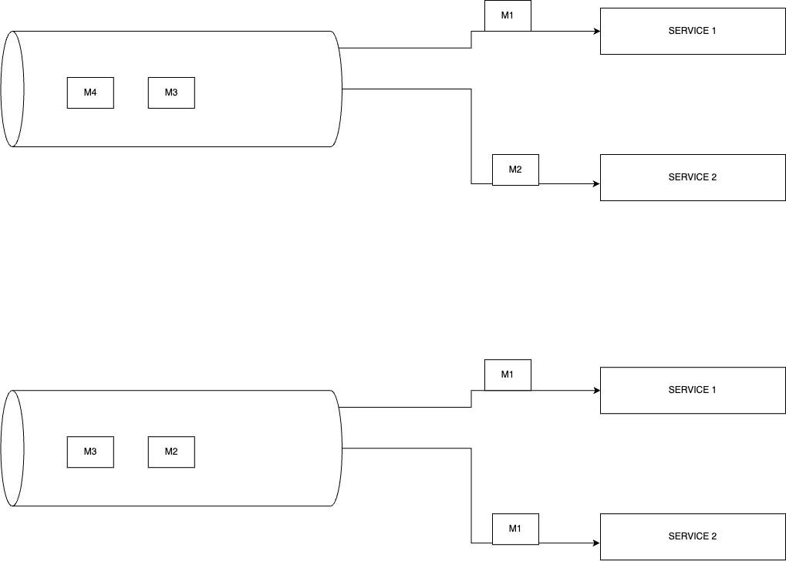

# System Design Study 01 - Payment System
This Article is set to discuss in summary (from System's Design Interview Book), key value points on high level design of a payment system.

A payment system could mean a wallet application such as Google Pay and Apple Pay or a SAAS(software as a service) such as paypal or stripe, but all these can be bundled up into one definition and simply put..

 *__"A Payment System is any system that can settle finanncial transaction through the transfer of monetary values from one stake holder to another "__*

We are going to be discussing the design similar to that of an **Amazon Pay** which handles payment from customers payment orders and in return makes payment to the sellers.We design with certain functional requirements in mind just for simplicity and not to go overboard , these requirements includes ;
1. 1 Payment Cards (credit, debit...) are used for payment into our system
2. 2 Third Party PSP (Payment System providers) are used for card processing
1. 3 Cards are not stored in Our system
1. 4 Our System supports only one currency
1. 5 Our System expects 1,000,000 transactions daily (1M/day in transactions)
1. 6 Our System supports A Payout flow (since this is an Amazon Pay kind of system where sellers are also included in the flow of transactions)
1. 7 Our System must be able to handle reconcilliation and settlemenent of any wrong/inconsistent data(transaction), therefore system stores states of transaction in flow.

We also take a look at some non-functional requirements that are not user-facing but impact the overall welfare of our system
1. 1 Our System must be reliable and fault-tolerant (failed payment need to be handled)
2. 2 Reconcilliation Process must be added for Failed payment and processing between internal systems(Payment system, accounting system, PSP)

In our system for simplicity we are prioritising the successful handling of payments and not database throughput since 1M transctions daily is a requirement that is little to cause issues for any database.

## High Level Design 

---

## Deep Dive

**Payment service**  ~  Accepts Payment from users and mostly dies the initial checks and fraud detection, compliance etc.

**Payment Executor**  ~  Executes payments based on the payment order received.

**Payment service Providers (PSP)**  ~  Third party application used payment and card processing

**Ledger and Wallet**  ~  Keep record of payment transaction flow and the later is for keeping balance of user account amount

## API Design 
---
For the API design we focus mainly on 2 endpoint namely :

    POST  /payments ~ sends a payment event which consist of payment orders
| Field | Desciption | Type |
| ------ | ----------- | ---|
| Buyer_info   | info on buyer | JSON |
| checkout_id | checkout id num | String|
| credit_card_info    | credit card info (Usually encrypted) | JSON |
| payment_orders    | payment orders for different possible sellers in the same checkout | JSON ARRAY

Data for payment_order would look like this below : 
| Field | Desciption |
| ------ | ----------- |
| seller_account   | string |
| amount | string |
| currency    | string |
| payment_order_id    | string |

*__It is  recommended to keep amount/numbers in string datatype due to different systems using different numeric precicsion__*

    GET  /payments/{payment_order_id} ~ returns status or info about a payment order with the payment_order_id

## Database Design
For the database since there is possibility of a lot of relationship between entities and we want a certain level of ACIDity(Atomicity, Consistency, Isolation, Durability) in data we would go with an Relational SQL Database instead of NOSQL, we will focus on 2 main tables that are involved in the process from API design

*__payment_event_table__*
| Field | Desciption |
| ------ | ----------- |
| checkout_id   | string *__PK__* (primary key)|
| Buyer_info | string |
| seller_info    | string |
| credit_card_info    | string |
| is_payment_done    | string |

 

*__payment_order_table__*
| Field | Desciption |
| ------ | ----------- |
| payment_order_id   | string *__PK__* (primary key)|
| Buyer_account | string |
| amount | string |
| currency    | string |
| checkout_id   | string *__FK__* (foreign key)|
| payment_order_status    | string |
| ledger_updated    | boolean |
| wallet_updated    | boolean |

::: for payment_order_status ~
*__NOT_STARTED, EXECUTING SUCCESS FAILED__*
:::

 

### *__PAYOUT-FLOW__*
For the Payout-flow which is similar to the *__Pay in-flow__* on difference instead is using a PSP for automating payout to seller's account

 

## __Design Deep Dive__
In this section we focus on making the system into a more faster, reliable and secure distributed system as we place more attention on these various areas

1. 1 Reconciliation
2. 2 PSP Integration
1. 3 Handling Payment Processing delays 
1. 4 Communication among internal services
1. 5 Exact one Delivery (Idempotency)
1. 6 COnsistency
1. 7 Security

 

### *__PSP Integration__*
This looks at what part of the system we integrate the PSP(Payment Service Providers), due to simplicity would look into intregrating a PSP at the point of payment to handle the card information and buy activity

 

### *__Reconcillation__*
This is pretty much check and balancing for any discrepency, this is usually a batch at a given time that gets settlement from PSP about dailt transaction and matches with data on the system 

 

### *__Handling Payment processing Delays__*
Sometimes payment take time or even failto be processed from the PSP , one way to overcome is through communication of internal services , we look at 2 ways of inter-communication between services

 *__Synchronous communication__* ~ communication is done in a request-response manner where the service calling has to wait for the response for the called service, but there are a little cons(issues) with this form of communication :
1. 1 system is tightly knit 
2. 2 system is not autonomous

 *__ASynchronous communication__* ~ There is no waiting in this form of communication, we introduce a queue in this form of communication where events are moved to be processed and other services subscribe to recieve messages to be processed. This can be depicted in 2 ways 
    
1. *__Single Receiver__* ~ which can be implemeted by a shared queue, where multiple subscribers can receive messages respectively in the image below service1 and service2 both process M1

1. *__Multiple Receiver__* ~ Almost same as single receiver but service1 and service2 process only messages meant for each services

**Using a Message queue to process data will require measures to handle failures which are due to tracking of payment state these measures include:**
1. *__Retry__* ~ for retryable processes

1. *__Dead letter queue__* ~ for retryable processes also but in this data is put in a dead queue and can be replayed from such queue if retryable

 

### *__Double Payment__*
what happens when a user double click in quick succesions to pay for an item, we try to overcome such in 2 ways 
1. *__At Least Once__* ~ Using a Retry Mechanism

1. *__At Most Once__* ~ Using an Idempotency check, for commnication between clients (web applications) an idempotency key is usually a a key generated by the client and expires after a certain number of time , usually a UUID added to the header , from an API standpoint idemepotency means clients can make the same call repeatedly and pricue the same result

    1. Immediate retry
    2. Fixed interval Retry
    3. Incremental retry
    4. Exponential retry => **THIS IS WIDELY RECOMMENDED**

*we'd add more on this topic later*
 

### *__Payment Security__*
payment security is important and there are technologies and techniques used in ensuring a secured system

 | Problem | Solution |
| ------ | ----------- |
| request/response eavesdropping   | Use HTTPS |
| Man in the middle attack | SSL Certificate |
| Data-tampering     | Encryption |
| Fraud    | KYC |
| DDOS-attack     | Rate-limiting/firewall protection |
| Data Loss    | Database Replication |
| Card Theft    | Tokenisation, instead of using the real car , tokens are stored and used in palce |

 

## *__That's it Thank You for mAking it this Far !!! We now know how to think of such system!!__*

